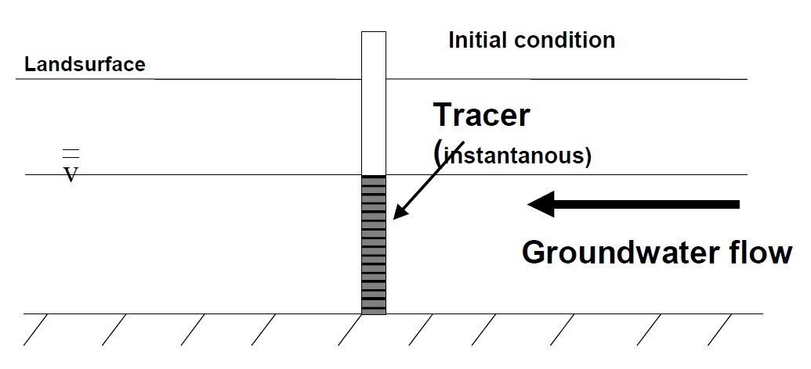
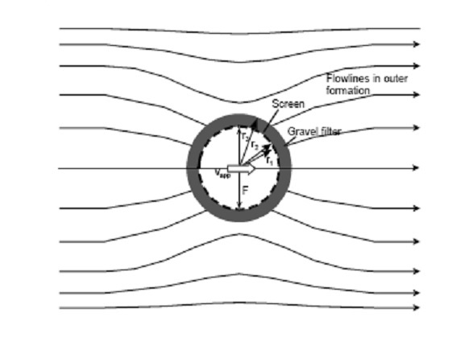

# Borehole-Dilution-Test


1.  Code description (purpose, motivation goals)
2. usage/run instructions
3. requirements (incl all non standard python libraries)
4. code diagram (uml/activity diagram)
5. usage of all functions incl classes (input arguements and output incl data types)


## Theoretical Background
The borehole dilution test or point dilution test is a single-well technique for estimating horizontal flow velocity in the
aquifer surrounding a well. The test is conducted by introducing a tracer into a well section and
monitoring its decreasing concentration over time. A tracer is instantaneously injected into a borehole and is perfectly mixed within the borehole for
the duration of testing in order to fulfil the ideal mixing condition. The mixing intensity should be
adjusted to limit any turbulence it might induce to the well tube area and should not affect flow in
the surrounding aquifer. The dilution of the tracer in the well due to the inflow of fresh water and
the outflow of tracer-laced water from the well is then measured over time.


**Fig 1*: Principle behind borehole dilution test*

Traditionally, the horizontal Darcy velocity is calculated as a function of the rate
of dilution and is based on the simple assumption that the decreasing tracer concentration is
proportional both to the apparent velocity into the test section and to the Darcy velocity in the
aquifer.

The dilution rate of the tracer solution, which is assumed to be homogeneously distributed in
borehole volume V, can be described by a simple differential equation derived from a 0-dimensional
balance in an ideal mixing reactor:

$$ {V' \over V}({c \over c_{0}}) = {dc \over dt} $$

with flux through the reactor $V' = {v_{app}}·F$, where vapp is the apparent dilution velocity (i.e., specific
flux) in the borehole due to groundwater-flow (m/s) and F is the area perpendicular to the direction
of undisturbed flow (m<sup>2</sup>); volume in which dilution takes place V [m3]; time t [s]; and actual and
initial concentrations c and co (kg/m<sup>3</sup>).
Separating variables and applying an initial condition (instantaneous tracer injection) leads to the
following analytical solution of the differential equation:

$$ {c \over c_{0}} = exp({-v_{app}.F.t \over V}) $$

or 

$$ {v_{app}} = -{V \over F.t} ln({-v_{app}.F.t \over V}) $$


Horizontal flow patterns in an aquifer are distorted by boreholes due to the well screen effect. This
effect is caused by convergence of the flow field due to contrasts in hydraulic conductivity between
the aquifer and the inside of the well (Figure 7.2). A dimensionless correction factor $\alpha$ can be used
to account for this distortion:

$$\alpha = Q_{b}/Q{f}$$




*Fig 2: Illustration showing the flowlines around the well and the well screen effect*

The correction factor $\alpha$ can be evaluated using potential theory as:

$$ {\alpha} = {4 \over {1 + ({r_{1} \over r_{2}})^2 + {k_{1} \over k_{2}}{[1 - ({r_{1} \over r_{2}})^2]}}} $$

with screen radii r1 and r2, screen permeability k1, and formation permeability k2. For the wells at
the site in Horkheim, the dimensions of the gravel filter and the screen/filter tube can be neglected,
and $\alpha = 2$. Considering:

$$ {v_{app}} = {v_{f} \alpha} $$

with Darcy velocity vf and assuming other complicating factors related to insufficient mixing, vertical
flow, density effects, etc. can be neglected, the following relationship follows:

$$ {v_{f}} = -{V \over \alpha.F.t} ln{c \over c_{0}} $$

### Purpose and motivation

Through this program, we want


The structure of the code is as follows:

.jpg)

### Software Requirements

The software requirements to successfully run this program and obtain the Darcy Velocity are:

Link to git repository to get the code:

```
git clone https://github.com/Mohammed-Fadul/Borehole-Dilution-Test.git
```
    

1. Anaconda navigator
2. Integrated Development Environments (IDEs): PyCharm or Visual Studio Code (im not entirely sure)
3. Python 3.9.16 or more recent versions
4. Numpy and pandas

### Obtaining results

Upon meeting software requirements and getting all the python files in the local device, run the main script to get the velocity.
Also, the graphs generating from the given data are saved in the folder SamplePlots.

## Code 

### Set the Frame 

The object-oriented code will use custom classes that are called within a `main.py` script which calculated the darcy´s 
velocity average. The code is based on custom classes and functions that are defined as the following:

* `checker.py` that contains logging functions.

* `tracertests.py` contains a Tracer class to read the basic elements of borehole test from field data and make basic dimension
calculations needed for the calculation of Darcy´s velocity.

* `sensor_data_file.py` that contains the DataSheet, Calibration and SensorPairData classes to read the data from the 
* sensors.

* `plotSensors2.py` that contains the functions for the plots calculation: sensors plot, time concentration plot and 
* velocity plot.

The relation among the classes and functions are according to the following diagram:

## diagram photo here

### LOGGING FUNCTIONS
```{admonition} Challenge
Code Requirements: necessary to import the logging.
```
the `checker.py` contain two functions:
1. `log_parameters` - it contains all the logging formats and characteristics. 
2. `logger` - this is a function wrapper for the main() functions that are going to execute log messages throughout 
the code.

### FIELD DATA 
```{admonition} Challenge
Code Requirements: necessary import the numpy and the logging_parameters function from the checker.py file.
```
The `tracertests.py` provides us variables and methods, which are relevant to Darcy´s velocity calculation. 
In the class `Tracer`, all the constant data taken from the local site test is found. They include: 
* Drilling´s and well´s diameter
* Well´s head above ground level
* Top of gravel pack below ground level
* Top of filter screen below ground level
* Bottom of well below ground level
* Depth of filter below well´s head
* Water table below well´s head
* Initial concentration of the tracer in the well
* Permeability of the gravel pack
* Permeability of the aquifer formation
* Accuracy of the fluorescence sensor.

By these information, we are able to execute calculations found in the different functions within the Tracer class.
* Top gravel pack (`top_gravel_pack`): distance from the wellhead to the top of the gravel pack 
* Top filter screen (`top_filter_screen`): distance from the wellhead to the top of the filter screen 
* Water head (`water_head`): profile of the water in the well measured from the bottom of the well 
* Volume in well (`volume_in_well`): the volume of the water in the well 
* Area of flow (`area_of_flow`): are perpendicular to the flow direction 
* Calculate alpha (`calculate_alpha`): correction factor borehole horizontal flow rate Qb and aquifer horizontal flow rate Qf 
* Calculate vf (`calculate_vf`): area of the screen filter 

### SENSORS DATA 
```{admonition} Challenge
Code Requirements: necessary to import the logging, pandas, numpy, typing and sklearn libraries, and inherit the file_utils 
from the BaseFile in __init__.py (packet base_files).
```
The provided Sensors data is stored in the xlsx workbook **All_Data.xlsx** and it contains the following information:

| **dilution time(s)** | **fluorescense** |
|----------------------|------------------|
| 0                    | 2                |
| 5                    | 5                |
| 10                   | 7                |
| ...                  | ...              |


| **Flourescense** | **µg/L Uranine** |
|------------------|------------------|
| -3               | 0                |
| 8                | 10               |
| 23               | 25               |
| ...              | ...              |

The dilution time vs fluorescense table is located in the **Data DC** and **Data FC** sheet, giving information of each 
sensor test. While, Flourescense vs Uranine table are located in the **DC calibration** and **FC calibration** sheet which 
there are information of the calibration for each sensor. 

* DataSheet: 
* CalibrationSheet:
* SensorPairData: 
* Basefile 

### PLOTS 
```{admonition} Challenge
Code Requirements: necessary to import logging, matplot and os libraries, and inherit from the file plot_saver the function 
save_plot.
```
The `plotSensors2.py`provides us the generation of plots - based on the matplot library - that allow better analysis of
the given data. They are:
* `sensors_plot`: generates the plot of Fluorescence vs Concentration for each sensor.
## PLOT PICTURE 
* `time_concentration_plot`: generates the plot of the Time vs Fluorescence for each sensor. 
## PLOT PICTURE 
* `velocity_plot`: generates the plot of the Darcy´s Velocity vs Time vs Fluorescence concentration for each sensor. 
## PLOT PICTURE 

The `plotSensors2.py` inherits the `plot_saver.py` which contains the function `save_plot` that allows the plot to be 
correctly saved in the -named given - folder. It also returns logging information in case of exceptions. 

NOTES: 

### DARCY´S VELOCITY CALCULATION 
```{admonition} Challenge
Code Requirements: necessary to import pandas and math libraries, and inherit from the tracertests.py, sensor_data_file, 
plotSensors2 and checker the necessary functions. 
```
The darcy´s velocity is calculated in the `main.py` script. In this file we can find: 
* `darcys_velocity_each_second`: this function returns the data frame containing the final darcy´s velocity of each time. 
It receives the field_data, the slope of the sensor´s equation and intercept of the sensor´s equation as parameters. 

* `darcys_velocity_averaged`: this function returns the averaged Darcy´s velocity, and 25% of the lower and upper values 
are excluded giving a 50% of range.

* `main`: the main function is responsible for calling the functions in the correct order: 
1. This fuction sets the document´s information (**All_Data.xlsx**) where all the necessary data to execute the 
`sensor_data_file.py` is required;
2. The instantiation of the objects and attributes are saved in the variables which take the information also from 
`sensor_data_file.py` (eg: regression line information, calibration information and sensors information);
3. After having all the necessary inputs, it is called `darcys_velocity_each_second` with the necessary parameters for 
each type of sensor;
4. The `darcys_velocity_averaged` is executed with a logging message that allows to know which type of sensor is this 
Darcy´s velocity result;
5. The information is saved in a excel file names **Results**;
6. Last, the plots are executed.

